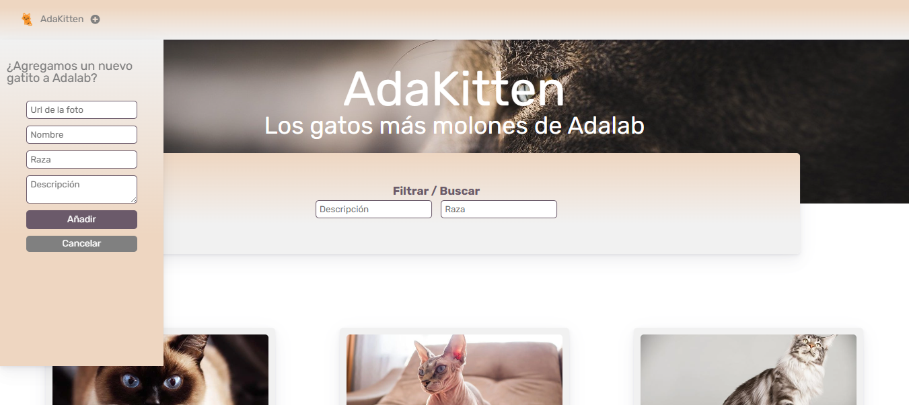
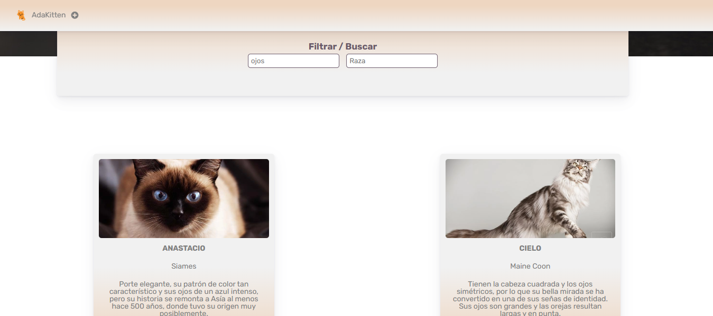
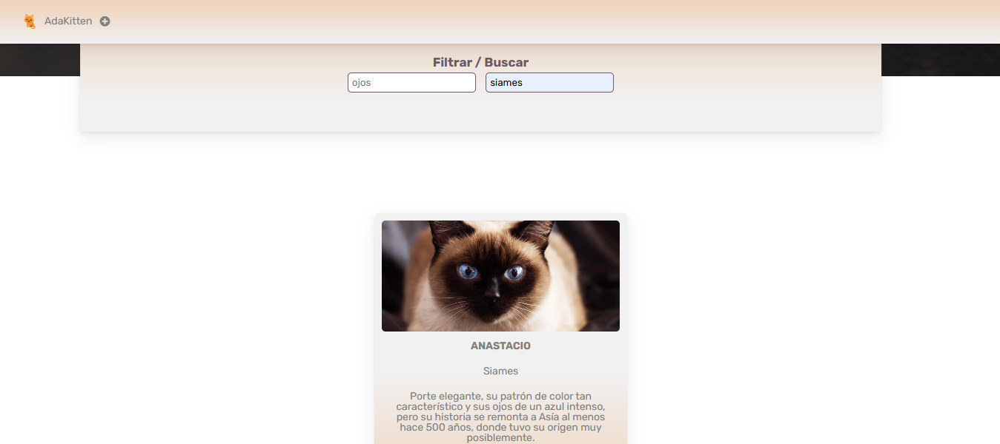
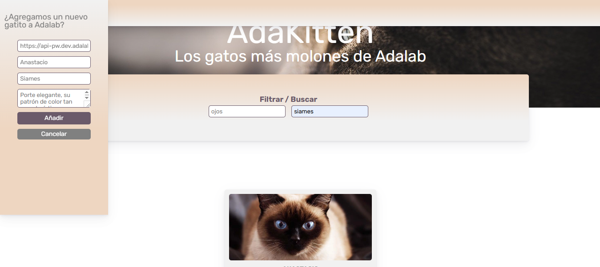

# AdaKitten


Aplicación web para gestionar y descubrir gatitos. Permite ver un listado de gatitos con su información, buscarlos por descripción y/o raza, y añadir, editar o eliminar gatitos de forma dinámica, con persistencia de datos en el navegador.

Este proyecto nace como ejercicio del módulo de JavaScript del Bootcamp de Adalab. Originalmente pensado para hacerse en pareja, lo he retomado y ampliado por mi cuenta tras finalizar el bootcamp, como repaso y para aplicar conceptos nuevos por iniciativa propia.

## Capturas de pantalla

### Listado general y formulario para añadir un nuevo gatito


### Filtrado por descripción


### Filtrado combinado (descripción + raza)


### Edición de gatito


## Tecnologías utilizadas


- HTML5
- CSS3
- JavaScript (Vanilla)
- LocalStorage para persistencia de datos

## Funcionalidades

- **Listado dinámico**: los gatitos se renderizan desde JavaScript a partir de un array de objetos.
- **Filtro por descripción y raza, combinados**: la usuaria puede buscar por uno de los dos campos o por ambos a la vez.
- **Búsqueda en tiempo real**: el filtrado se aplica automáticamente mientras se escribe, sin necesidad de pulsar un botón.
- **Mensaje de "sin resultados"**: si ningún gatito coincide con la búsqueda, se informa a la usuaria en vez de dejar el listado vacío sin explicación.
- **Añadir nuevos gatitos**: formulario para registrar un nuevo gatito con foto, nombre, raza y descripción.
- **Editar gatitos existentes**: el formulario se rellena automáticamente con los datos del gatito seleccionado para modificarlos.
- **Eliminar gatitos**: cada tarjeta cuenta con un botón para borrar el gatito del listado.
- **Scroll automático**: al editar un gatito, la página se desplaza automáticamente hasta el formulario; al guardar, se desplaza hasta el gatito recién añadido o editado.
- **Persistencia con LocalStorage**: los gatitos añadidos, editados o eliminados se guardan en el navegador, por lo que los cambios se mantienen aunque se recargue la página.
- **Raza opcional**: si un gatito no tiene raza especificada, se muestra el mensaje "Uy qué despiste, no sabemos su raza" en lugar de dejar el campo vacío.

## Cómo ejecutar el proyecto

1. Clona este repositorio:
   ```bash
   git clone https://github.com/Karengonsan/AdaKitten.git
   ```
2. Abre la carpeta del proyecto en tu editor de código.
3. Abre el archivo `index.html` con Live Server (extensión de VSCode) o directamente en tu navegador.

No requiere instalación de dependencias ni configuración adicional.

## Posibles mejoras futuras

- Validación visual más completa de los campos obligatorios del formulario (bordes y mensajes de error en tiempo real).
- Ordenación del listado por nombre, raza o fecha de incorporación.
- Posibilidad de subir una imagen desde el propio dispositivo en lugar de pegar una URL.
- Confirmación antes de eliminar un gatito, para evitar borrados accidentales.
- Paginación o scroll infinito si el listado de gatitos crece mucho.

## Autoría

Proyecto desarrollado por [Karen Gonsan](https://github.com/Karengonsan) como ejercicio del Bootcamp de Adalab, ampliado posteriormente de forma individual.
